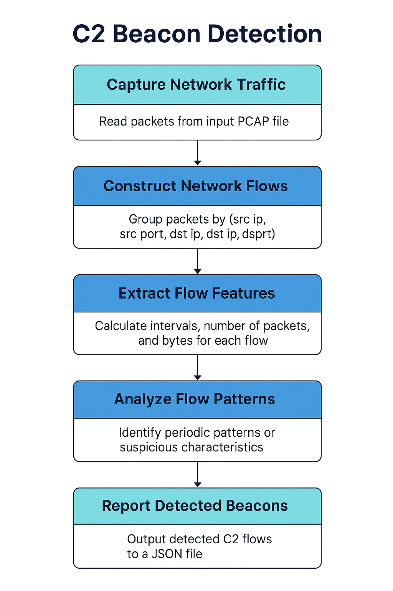

# 🕵️‍♂️ C2 Beacon Detector

A Python-based analysis tool for detecting potential **Command-and-Control (C2) beaconing** activity in PCAP network captures.  
Designed for threat hunting and Digital Network Exploitation Analyst (DNEA) workflows, the tool analyzes network flows for beacon-like behavior, such as consistent periodic communication to the same endpoint.

---

## 📌 Features

- **PCAP Parsing** using [PyShark](https://github.com/KimiNewt/pyshark) (tshark wrapper)
- **Flow Reconstruction**: Groups packets into flows by `(source IP, destination IP, protocol)`
- **Beacon Detection**:
  - Detects repeated connections at consistent time intervals
  - Identifies suspiciously low standard deviation in flow timings
- **JSON Reporting** for easy SIEM ingestion or further analysis
- **Configurable Parameters** for tuning sensitivity

---

## 📂 Project Structure

c2-beacon-detector/
├── detector/
│ ├── init.py
│ ├── flow_builder.py # Builds flows from PCAP packets
│ ├── main.py # Main analysis engine
│ ├── report_writer.py # Saves detection results to JSON
├── example/
│ └── sample.pcap # Example PCAP for testing
├── docs/
│ └── detection_flow.png # Visual workflow diagram
├── run_detector.py # CLI entry point
├── requirements.txt # Python dependencies
└── README.md


---

## 📊 Detection Workflow



---

## ⚡ Installation

> **Tested on Kali Linux & Ubuntu (WSL)**

1. **Clone the repo**  
   ```bash
   git clone git@github.com:zachlorenz/c2-beacon-detector.git
   cd c2-beacon-detector
Create & activate a virtual environment

python3 -m venv venv
source venv/bin/activate
Install dependencies

pip install -r requirements.txt
Ensure tshark is installed

sudo apt update && sudo apt install tshark -y
🚀 Usage
Basic beacon detection:

python run_detector.py example/sample.pcap
Output will look like:

[+] Building flows...
[+] Analyzing flows for beaconing...
Suspicious flow: 192.168.1.15 → 203.0.113.5 | Interval: 60.0s ± 0.2s | Count: 15
[+] Results saved to results.json
⚙️ Configuration
You can adjust sensitivity by modifying constants in detector/main.py:

INTERVAL_TOLERANCE = 0.5  # seconds
MIN_PACKET_THRESHOLD = 5  # minimum packets for analysis
📄 Output
Detection results are saved to results.json:

[
  {
    "src": "192.168.1.15",
    "dst": "203.0.113.5",
    "protocol": "TCP",
    "interval": 60.0,
    "std_dev": 0.2,
    "count": 15
  }
]
🧠 Why This Project?
As a Digital Network Exploitation Analyst (DNEA), identifying beaconing patterns is critical for uncovering:

Malware C2 channels

Stealthy data exfiltration

Compromised insider devices

This tool demonstrates:

Network protocol understanding

Traffic analysis

Practical Python development skills

Ability to turn detection logic into operational tooling

🛠️ Future Improvements
Add CLI flags for threshold tuning

Integrate with Zeek logs as an input source

Add visualization of beacon intervals

Multi-threaded processing for large PCAPs

📜 License
MIT License — see LICENSE for details.

Author: Zach Lorenz

